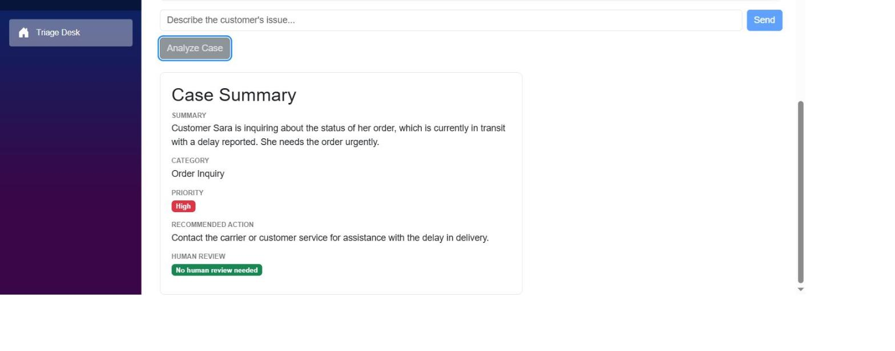

# AI Support Triage Desk

A Blazor support assistant built with Microsoft Agent Framework, MCP tools and strongly typed structured outputs.

## Problem statement

A support employee at a small e-commerce company gets messages like *"My order ORD-1024 hasn't arrived and I need it before Friday — what happened?"* and has to manually check multiple systems (customer records, order/shipping status) before they can respond. This app puts an AI agent in front of that workflow: the employee describes the issue in a chat, the agent decides when it needs real customer or order data, fetches it through tools instead of guessing, explains the situation conversationally, and — on request — produces a strongly typed case summary (category, priority, recommended action, whether a human needs to step in) that the UI renders as a proper panel instead of raw JSON.

## Screenshot



## Architecture

```
Blazor UI (SupportTriage.Web)
  |
  +-- Triage.razor (chat + Analyze Case + result panel)
  |
  +-- SupportAgentService
        |
        +-- Microsoft Agent Framework (ChatClientAgent, OpenAI gpt-4o-mini)
              |
              +-- Function tool: GetCustomerByEmail (CustomerLookupService, in-process C#)
              |
              +-- MCP client (McpToolProvider) --stdio--> SupportTriage.McpServer (separate process)
                                                              |
                                                              +-- GetOrder tool (mock order data)
              |
              +-- Structured output: RunAsync<SupportCaseResult>()
```

Two projects, per the brief's suggested split:

- **`src/SupportTriage.Web`** — the Blazor Server app, the agent configuration, and the local `GetCustomerByEmail` function tool.
- **`src/SupportTriage.McpServer`** — a tiny stdio MCP server exposing `GetOrder`, launched as a child process by the Web app on startup.

All data is hard-coded in memory (a few customers, a few orders) — no database, on purpose.

## Three concepts this project demonstrates

1. **Agent Framework chat** — `SupportAgentService` wraps a `ChatClientAgent` (OpenAI `gpt-4o-mini` via `Microsoft.Agents.AI.OpenAI`) and reuses one `AgentSession` across turns, so the employee can ask follow-up questions and the agent remembers prior context.
2. **Tools, both local and MCP** — the agent can call `GetCustomerByEmail` (a plain C# function, in-process) and `GetOrder` (a real external tool served by `SupportTriage.McpServer` over the Model Context Protocol, talked to via the official MCP C# SDK). Its instructions explicitly forbid inventing customer or order data — try an unknown email or order number and it will say so rather than making something up.
3. **Structured output** — clicking **Analyze Case** calls `agent.RunAsync<SupportCaseResult>(...)`, which constrains the model's response to a JSON schema generated from the `SupportCaseResult` class and deserializes it back into a real object. The UI renders `Summary`, `Category`, `Priority`, `RecommendedAction`, and a human-review badge as actual Blazor markup — never raw JSON.

## Setup

**Prerequisites:** .NET 10 SDK, an OpenAI API key.

1. Clone the repo and set your API key as a user secret (never commit it to `appsettings.json`):

   ```
   cd src/SupportTriage.Web
   dotnet user-secrets set "OpenAI:ApiKey" "sk-..."
   ```

2. Run the Web app — it automatically launches `SupportTriage.McpServer` as a child process on startup, so you only need to start one project:

   ```
   dotnet run
   ```

   This uses the `http` launch profile (sets `ASPNETCORE_ENVIRONMENT=Development`, which is required for user secrets to load) and opens your browser automatically. If nothing opens, navigate to the URL printed in the console (e.g. `https://localhost:7276`).

   The optional `OpenAI:Model` config key defaults to `gpt-4o-mini`.

## Example prompts

Seeded data includes customer `sara@example.com` and order `ORD-1024` (In Transit), plus a couple of other customers/orders.

- *"Hi, I am Sara. My email is sara@example.com. Order ORD-1024 still hasn't arrived. I need it urgently. Can you check what happened?"* — the acceptance scenario; the agent should call both tools and, on Analyze Case, produce something like Category: Order Inquiry, Priority: High, Recommended Action: contact the carrier.
- *"Can you check order ORD-9999?"* — an unknown order; the agent should say it wasn't found rather than inventing a status.
- *"What's the membership tier for someone@nowhere.com?"* — an unknown customer; same honesty check for the local function tool.

## Notes

- No API keys are committed. `appsettings.json` only documents the config shape (`OpenAI:ApiKey` = `""`); the real key lives in `dotnet user-secrets`, outside the repo entirely.
- The practice brief PDF this project was built from is intentionally excluded from git via `.gitignore`.
